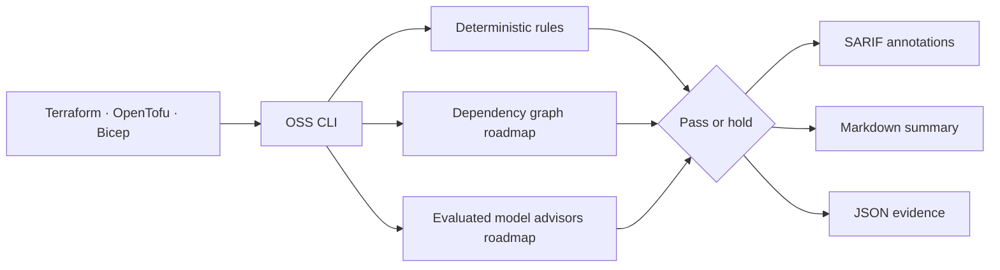

# Azure Well-Architected AI Reviewer

[](https://github.com/AAH20/azure-well-architected-ai-reviewer/actions/workflows/ci.yml)

Open-source **Azure architecture review** for **Terraform**, **OpenTofu**, and **Bicep** pull requests. It produces line-level **SARIF**, Markdown and JSON findings across Azure networking, reliability, FinOps, security, observability and business-impact assumptions.

> **Evidence boundary:** v0.1 is a deterministic static-analysis MVP. It does not yet call an LLM, parse Terraform plans, query Azure or prove runtime behavior. “AI” describes the evaluated advisory layer on the roadmap—not a hidden or fabricated capability.

## One-minute use

```bash
python3 -m pip install .
azure-architecture-review . --format markdown
```

To reproduce the test and benchmark evidence without installing:

```bash
bash scripts/validate.sh
```

Review an intentionally unsafe fixture:

```bash
PYTHONPATH=src python3 -m azure_arch_review.cli tests/fixtures/unsafe.tf \
  --rules rules/azure-rules.json \
  --format markdown
```

The command returns `hold` for error or critical findings when `--fail-on-hold` is supplied.

## GitHub Action

```yaml
name: Azure architecture review
on: [pull_request]

permissions:
  contents: read

jobs:
  review:
    runs-on: ubuntu-latest
    steps:
      - uses: actions/checkout@v4
      - uses: AAH20/azure-well-architected-ai-reviewer@v1
        with:
          path: .
          fail-on-hold: true
```

The initial release should be pinned by commit SHA in sensitive environments. A `v1` tag will only be created after the public repository and action have been verified.

## What it catches today

| Rule | Domain | Example consequence |
|---|---|---|
| `AZR-NET-001` | Azure networking | Public data-plane exposure |
| `AZR-STO-001` | Storage security | Anonymous blob-publication path |
| `AZR-OBS-001` | Observability | Insufficient investigation window |
| `AZR-K8S-001` | AKS reliability | Single-node production capacity |
| `AZR-TLS-001` | Platform security | Legacy transport protocol |
| `AZR-FIN-001` | FinOps | Premium tier without economic justification |

Every finding includes a pillar, remediation, source line and explicit cost/risk assumptions. See [rule authoring](docs/rule-authoring.md).

## Example output

```text
Decision: HOLD

ERROR: Single-node production capacity
Location: tests/fixtures/unsafe.tf:9
Pillar: Reliability
Impact: node-level single point of failure
Modeled annual risk exposure: $8,200
Remediation: justify minimum nodes, autoscaling and zone-failure behavior
```

The dollar value is a declared test assumption—not predicted loss.

## Distribution architecture



Distribution layers:

1. Python CLI
2. Composite GitHub Action
3. SARIF for native code-scanning presentation
4. Docker and Azure DevOps extension roadmap
5. GitHub App and hosted organizational architecture graph roadmap
6. Azure Developer CLI template for the optional hosted profile

## Azure Developer CLI profile

```bash
azd init --template AAH20/azure-well-architected-ai-reviewer
azd provision
```

The default Bicep profile creates a resource group and Log Analytics workspace. The Container Apps environment is disabled by default. Do not provision only for screenshots; estimate and approve the expected spend first.

## Senior architecture boundaries

- Model output is advisory and cannot override deterministic gates.
- A reviewer must not expose repository content to remote providers without explicit configuration.
- Cost and risk assumptions are visible and replaceable.
- Static analysis, Azure validation and runtime evidence are distinct evidence classes.
- Private networking requires DNS, routing and operational-access validation—not a boolean checkbox.
- Remediation is not considered valid until its IaC compiles and the relevant test passes.

## Roadmap

- Terraform plan and Bicep AST resource graph
- Diff-aware cost estimation
- SLO and architecture-decision context
- Azure Resource Graph and Advisor enrichment
- NVIDIA NIM, Azure-hosted and frontier-model advisor adapters
- Model evaluation by precision, remediation success, latency and cost
- Azure DevOps extension and GitHub App
- 100-case public Azure IaC architecture benchmark
- Organization-level historical architecture graph

## Positioning and commercial path

The OSS reviewer is the adoption surface. Enterprise services can include private rule packs, custom cost contracts, architecture graph hosting, Azure DevOps integration, platform remediation and continuous Azure architecture retainers.

For Azure Solutions Architecture, cloud modernization and managed platform engineering, visit [A2Z SOC](https://a2zsoc.com/).

## License

MIT. See [LICENSE](LICENSE) and [SECURITY.md](SECURITY.md).
